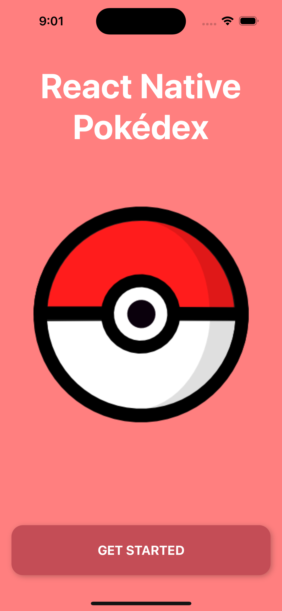
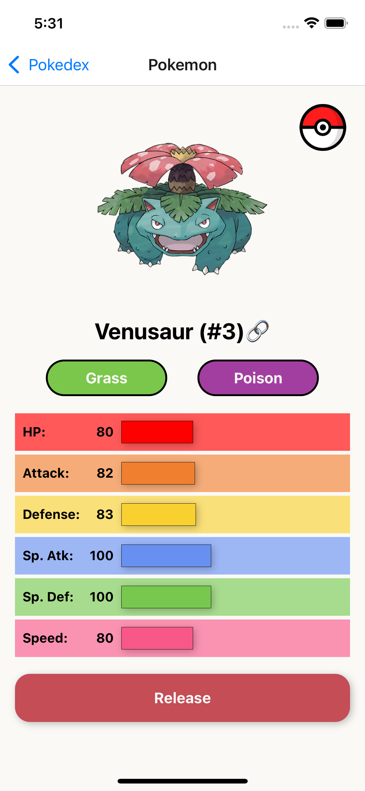
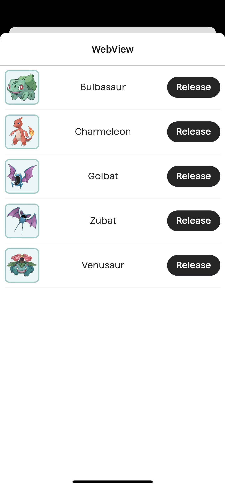

# React Native Workshop

Sample repository that aims to build a simple Pokédex app that applies the following concepts:

1. React Native UI primitives (View, Text, Button, etc)
2. Navigation stacks using [React Navigation][react-navigation]
3. Fetching remote data using `fetch`
4. Basic animation (animated values, interpolation, events, etc)

## Setup

```bash
# Install all required dependencies
npm install
```

```bash
# Start the Expo packager
npm start
```

All of the dependencies necessary for this project have been added, so you don't have to worry about finding compatible matches.

## What is the intent of this Repository?

We aim to provide you with the initial boilerplate to build your first React Native app using [Expo][expo].

## App Structure

Your app should be have the following structure:

- **Home Screen**
  - Present the app title, logo and a call to action that navigates to the main screen
- **Pokédex Screen**
  - Lists all Pokémon using the [PokéAPI](poke-api)
  - Every row should display the Pokémon name
  - Navigates to the Pokémon screen by touching on entry entry in the list
  - Navigates to the webview, that lists all captured Pokémon, by touching the top right Pokéball icon
- **Pokémon Screen**
  - Should receive the Pokémon name and fetch the rest of the data using the [PokéAPI](poke-api)
  - The details should contain the following attributes:
    - Pokémon name and ID
    - All the types associated with it (`Grass`, `Poison`, `Flying`, etc)
    - All the 6 stats associated with it (`HP`, `Attack`, `Defense`, `Special Attack`, `Special Defense` and `Speed`)
    - A button that allows you to capture the detailed Pokémon (or release it if it has been captured before)
    - A link that navigates to that Pokémon entry in the [Bulbapedia][bulbapedia]
    - A button to navigate to the Pokémon webview on the top right corner, **if the Pokémon has been captured**
- **Webview**
  - A webview that handles displaying both external and internal websites
  - The "supported" (i.e used in this project) websites are the following:
    - [Bulbapedia][bulbapedia] (External)
    - [Captured Pokémon list][captured-webview] (Internal)

> [!TIP]
> We have provided a guiding [theme.ts](./theme.ts) file that should help you to kickstart your project. Feel free to customize it as much as you want.

### Screenshots

<table>
  <tr>
    <th style="text-align: center;">Home></th>
    <th style="text-align: center;">Pokédex</th>
    <th style="text-align: center;">Pokémon</th>
    <th style="text-align: center;">Bulbapedia</th>
    <th style="text-align: center;">Captured List</th>
  </tr>
  <tr>
    <td></td>
    <td></td>
    <td></td>
    <td></td>
    <td></td>
  </tr>
</table>

### API

This projects uses the [PokéAPI][poke-api] project, which provides a free and open REST API. No authentication is necessary, but use it with conscience.

### WebView

The webviews in this project use the [react-native-webview](https://github.com/react-native-webview/react-native-webview) library, including its messaging protocol to communicate with the React Native application.

The webviews access two main URLs:

- **Public**: https://bulbapedia.bulbagarden.net
- **Internal**: https://rn-workshop.development.useorigin.com

The **internal** webview communicates with the React Native application through the following messaging contract:

```ts
type CapturePokemonsWebViewMessage = {
  code: "capture_pokemons";
  // The "Pokemon" entity needs to be derived from the PokéAPI data
  data: Pokemon[];
};
type ReleasePokemonWebViewMessage = {
  code: "release_pokemon";
  // The Pokémon ID
  data: number;
};
type NavigateToPokemonWebViewMessage = {
  code: "navigate_to_pokemon";
  // The Pokémon Name
  data: string;
};
```

### Unblocking your progress

If you are following this workshop and get stuck in any of the steps (or maybe just need some creativity boost), you can check the [example](/example) folder, which has a complete example.

> [!TIP]
> We recommend using the example folder just as reference, and not directly copying any of its content, so you can learn the foundations and solidify your knowledge!
>
> Running the example is also possible by navigating to the `examples` folder and following the [same setup commands as the main app](#setup).

## References

- [React Native][react-native]
- [Expo][expo]
- [React Navigation][react-navigation]
- [PokéAPI][poke-api]
- [Bulbabpedia][bulbapedia]

<!-- LINKS -->

[react-native]: https://reactnative.dev/
[react-navigation]: https://reactnavigation.org/
[poke-api]: https://pokeapi.co/
[expo]: https://expo.dev/
[bulbapedia]: https://bulbapedia.bulbagarden.net/
[captured-webview]: https://rn-workshop.development.useorigin.com
